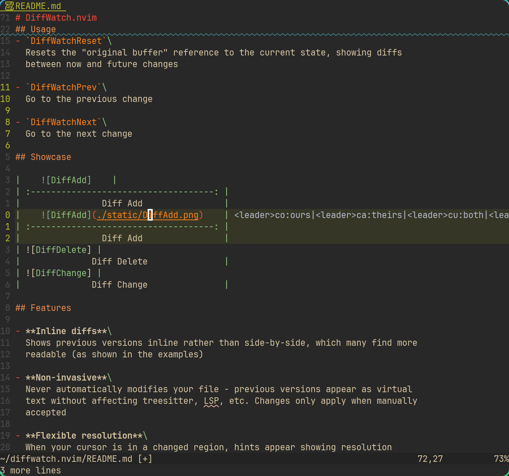
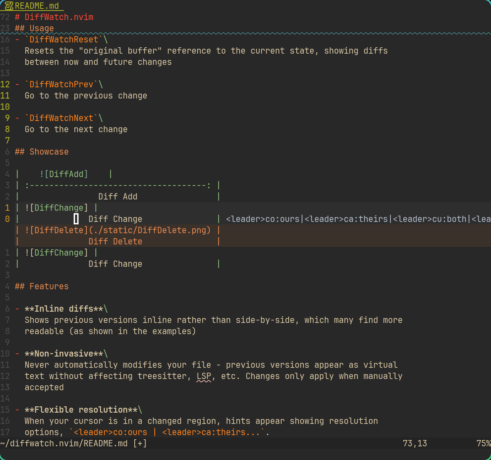

# DiffWatch.nvim

A QoL plugin for display diff between the current buffer and the previous one.

## Usage

This plugin provides the following two user commands:

- `DiffWatch`\
  Toggle the "DiffWatch", i.e., whether to watch the current buffer for diff.

- `DiffWatchReset`\
  Reset the "original buffer" to the current buffer, so that show diff between
  the current and the future.

## Showcase

|        |
| :------------------------------------: |
|                Diff Add                |
|  |
|              Diff Delete               |
|  |
|              Diff Change               |

## Feature

- Inline diff.\
  As you can see in the showcases, the previous codes are displayed inline, not
  the canonical side-by-side way, I find it more eye-friendly.

- No code insert into your file automatically.\
  I'm often afraid that the previous codes will be inserted into my file and
  break treesitter, lsp, etc. But this plugin does not do anything to your file
  unless you accept the changes manually. The point is that the previous codes
  will be displayed as **virtual lines**.

- Ours, theirs, both and none.\
  When cursor is inside one change, a hint will be displayed at the right after
  the eol like `<leader>co:ours|<leader>ca:theirs...`, to prompt the keymaps you
  can use to resolve the change. Currently there are four resolution methods:

  - `ours`: Use codes from the previous buffer.
  - `theirs`: Use current codes.
  - `both`: Use both.
  - `none`: Use none.

- Navigation between changes.\
  The plugin provide default keymaps `[w`, `]w` for easily navigating changes.

## Why This Plugin?

Keep It Simple and Stupid!

I previously use `avante.nvim` for quickly applying AI generated code to the
buffer, but I find it complicated to use a huge plugin (imo) for only one small
feature that may be even borrowed from other plugins like `git-conflict.nvim`.
