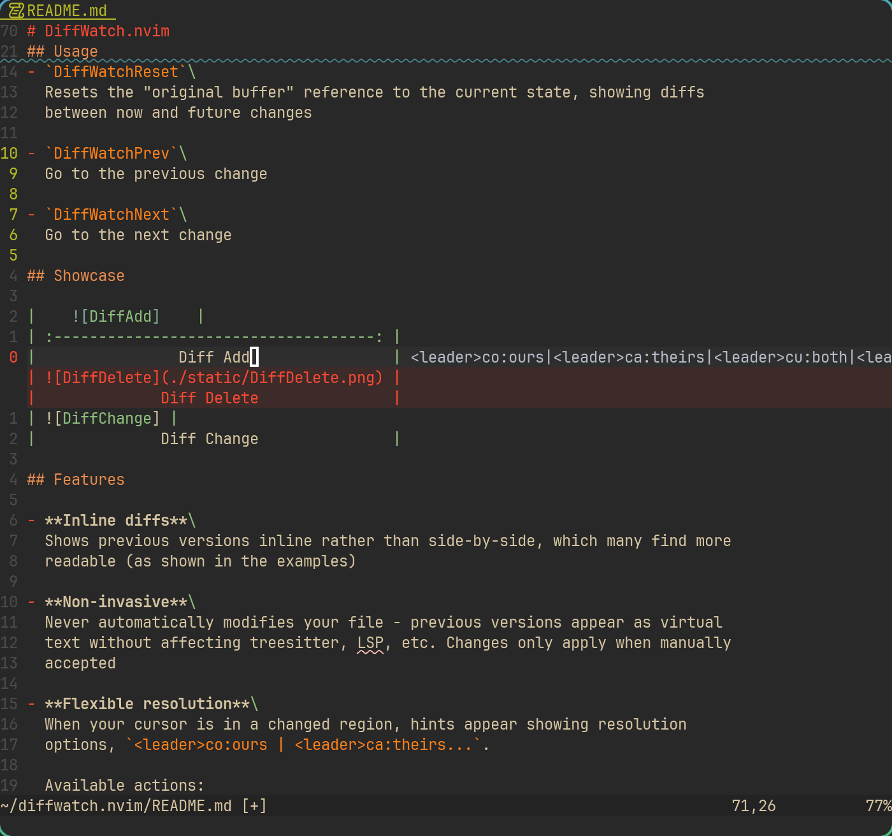

# DiffWatch.nvim

A QoL plugin that displays inline diffs between the previous and current buffer
state, with intuitive navigation and change resolution.

## Installation

With `lazy.nvim`:

```lua
return {
    {
        "yuukibarns/diffwatch.nvim",
        keys = {
            { "<leader>cw", "<Cmd>DiffWatchToggle<CR>", desc = "Diff Watch Toggle" },
            { "<leader>cr", "<Cmd>DiffWatchReset<CR>",  desc = "Diff Watch Reset" },
            { "[w",         "<Cmd>DiffWatchPrev<CR>",   desc = "Diff Watch Prev" },
            { "]w",         "<Cmd>DiffWatchNext<CR>",   desc = "Diff Watch Next" },
        },
        config = function()
            require("diffwatch").setup({
                -- Configuration goes here
            })
        end
    },
}
```

Default configuration:

```lua
local CONFIG = {
    highlights = {
        added = 'DiffWatchAdd',         -- Added lines
        changed = 'DiffWatchChange',    -- Changed lines
        removed = 'DiffWatchDelete',    -- Removed lines
        modified = "DiffWatchModified", -- Modifed lines
        hint = 'DiffWatchHint',         -- Hint text
    },
    mappings = {
        ours = "<leader>co",
        theirs = "<leader>ca",
        both = "<leader>cu",
        none = "<leader>cn",
    },
    hint_position = 'eol_right_align',
}
```

## Usage

This plugin provides following commands:

- `DiffWatch`\
  Toggles watching the current buffer for changes.

- `DiffWatchReset`\
  Resets the "original buffer" reference to the current state, showing diffs
  between now and future changes

- `DiffWatchPrev`\
  Go to the previous change

- `DiffWatchNext`\
  Go to the next change

## Showcase

|        |
| :------------------------------------: |
|                Diff Add                |
|  |
|              Diff Delete               |
|  |
|              Diff Change               |

## Features

- **Inline diffs**\
  Shows previous versions inline rather than side-by-side, which many find more
  readable (as shown in the examples)

- **Non-invasive**\
  Never automatically modifies your file - previous versions appear as virtual
  text without affecting treesitter, LSP, etc. Changes only apply when manually
  accepted

- **Flexible resolution**\
  When your cursor is in a changed region, hints appear showing resolution
  keymaps, `<leader>co:ours | <leader>ca:theirs...`.

  Available actions:
  - `ours`: Keep previous version
  - `theirs`: Keep current changes
  - `both`: Combine versions
  - `none`: Remove both

- **Change navigation**\
  Provides user commands `DiffWatchPrev` and `DiffWatchNext` for jumping between
  changes

## Why This Plugin?

Keep It Simple and Stupid!

I previously used `avante.nvim` for applying AI-generated code, but found it
unnecessarily complex when I only needed one small feature that may be even
borrowed from plugins like `git-conflict.nvim`.
